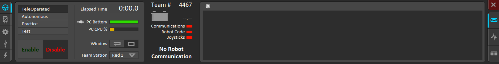
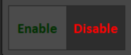
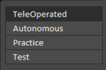

Driver Station
==============

The driver station is one of the most used programs by all teams, so using it
should be something that all member should be able to do. This will be a walkthrough 
of some of it's basic structures, as well as how to connect to a generic robot
and get it driving.

Driver Station Overview
-----------------------

This is what the driver station looks like when first opened:

Enable/Disable
--------------

The most important part is the two big buttons in the bottom left corner:

This enables the robot (allowing it to move/be controlled by the driver),
or disables it (the default state, it can't do anything here). You can also enable the 
robot by hitting :code: `[ ] \`, and can be disabled by hitting :code: `enter`.

Control Modes
-------------

Right above the enable and disable buttons is a list of option. These change what
mode you're enabling  when you run the robot.

As you can see, there are four different modes:

1. TeleOperated
    In this mode, a driver and an operator use joysticks to manually control the robot.

2. Autonomous
    This mode causes the robot to run a set of pre-coded instructions. There is usually a selector on the dashboard
    to switch between different autonomous routines.

3. Practice
    In practice mode, the robot will cycle through the two first modes the way that it would in an actual match, 
    starting with 15 seconds of autonomous, and then the remaining time in teleoperated. These times can be adjusted 
    within the driver station.

4. Test
    Test mode is used to run additional code that won't be run in matches.
    
 Indicators
 ---------------
 
 To the right of both previous items is a variety of indicators:
 
 .. image:: images/ds-indicators.png
 
 The most important of these include a battery change meter, which shows the amount of battery left in voltage (12-13 is charges, 11.5 or lower is dead), and three indicators that show communication to the robot, if there is running robot code, and weither there is a joystick connected.

